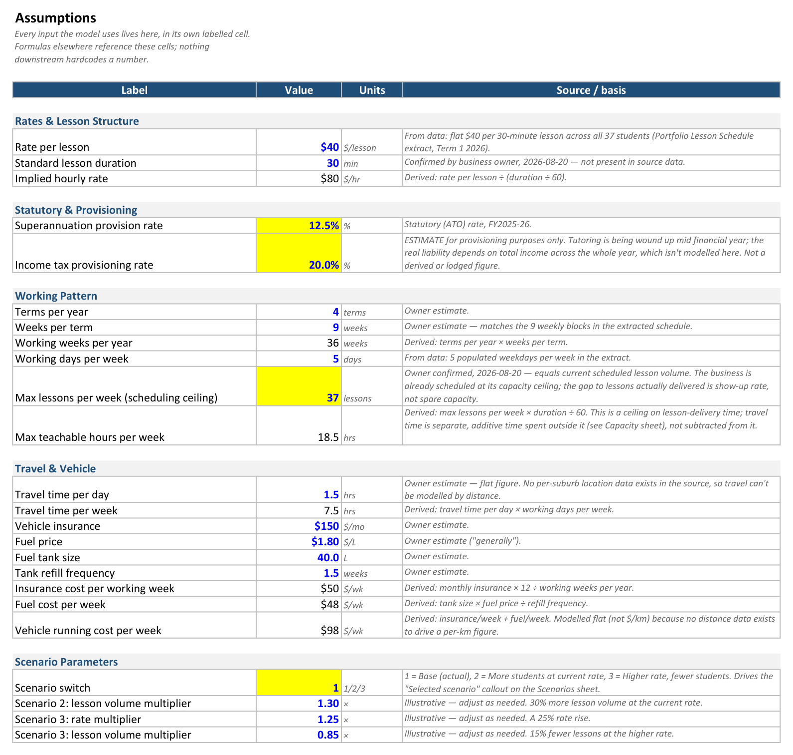
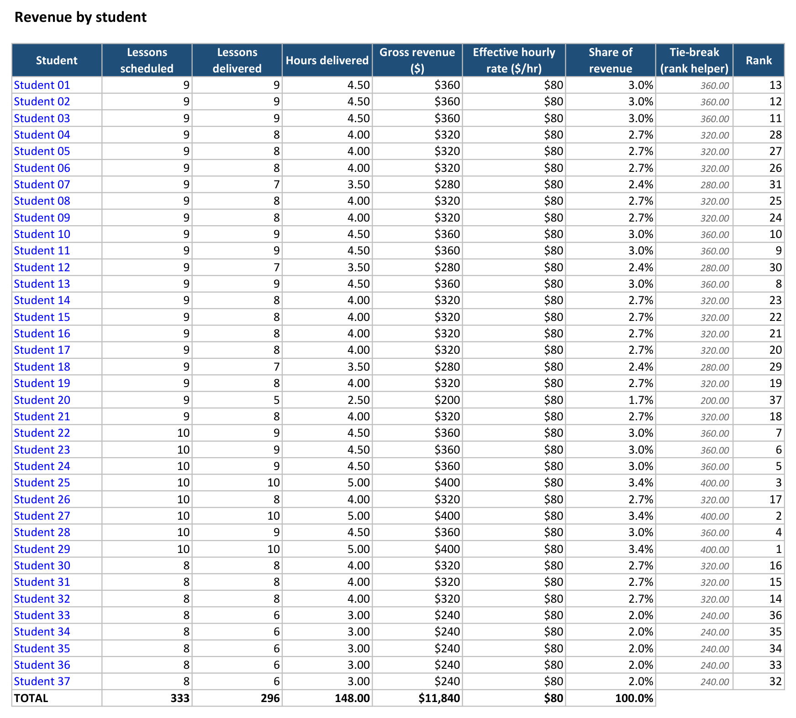
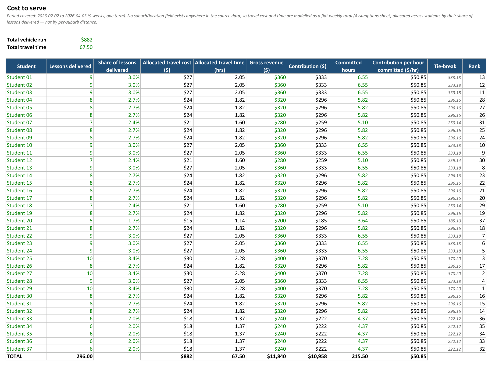
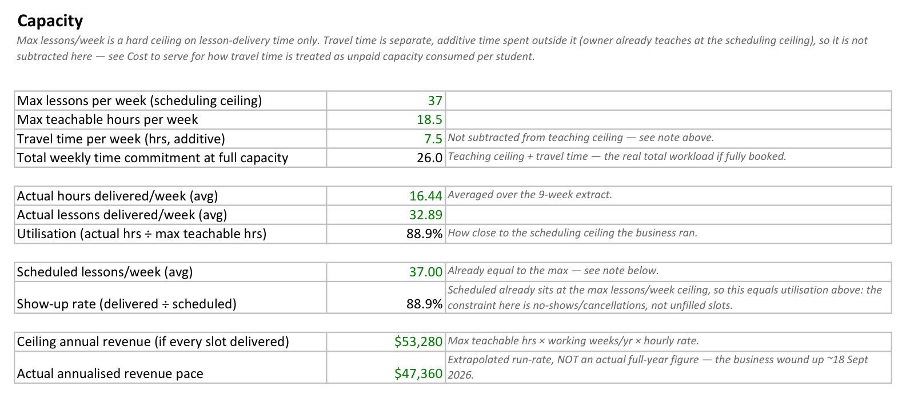
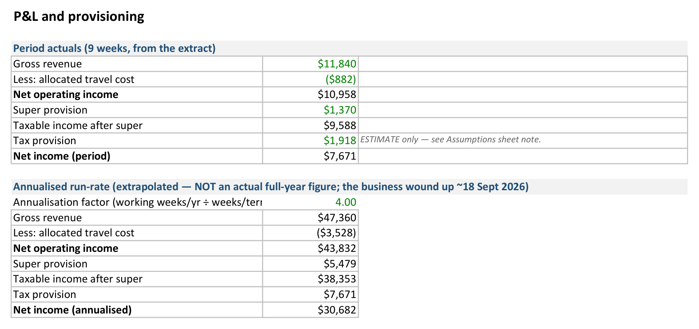
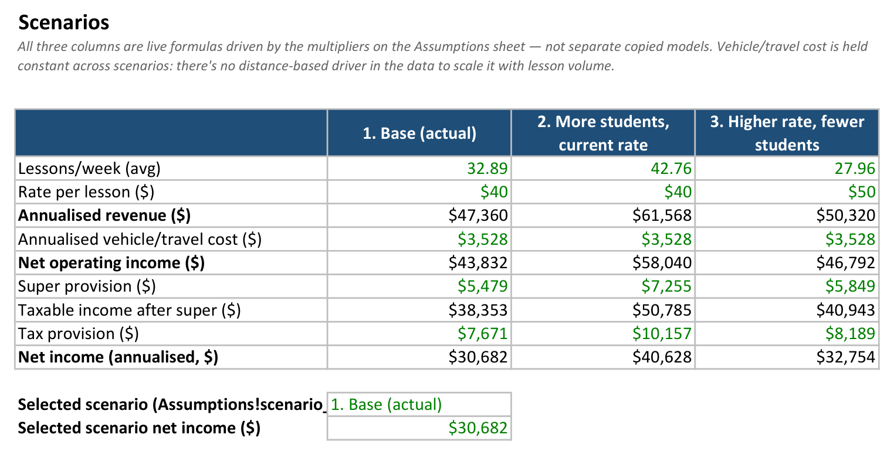
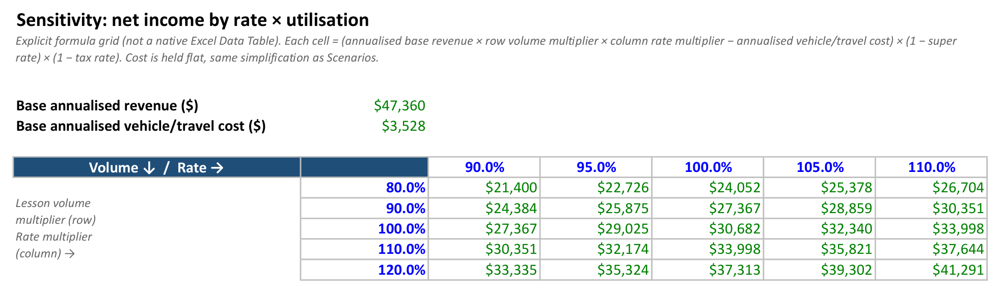
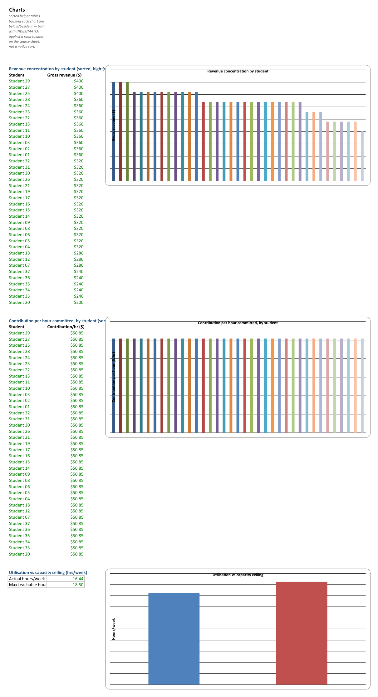

# Tutoring Business Financial Model

A driver-based Excel financial model of a private music-tutoring business, built from
its actual lesson-schedule and billing data for one school term — not invented numbers.

**As at:** 2026-08-20. **The business wound up ~18 September 2026** (end of school term),
so the annualised figures below are an extrapolated run-rate, not a real full year.

## Why this exists

This is the data/analytics entry in a three-part portfolio for a graduate job search in
Flanders (Microsoft-stack market, hence Excel rather than Sheets). The point isn't
spreadsheet decoration — it's driver-based structure, documented assumptions, and
scenario/sensitivity analysis applied to a business I actually ran. It sits in its own
repository (rather than a `spreadsheets/` folder inside a larger repo) so it has a clean
landing page a reviewer can open directly, separate from the other portfolio pieces.

## Anonymisation

Every student in this workbook is a pseudonym (`Student 01`–`Student 37`). No real name,
parent name, email address, or address appears anywhere in the repository or the
workbook — checked by grepping the built `.xlsx`'s shared-strings table, not just the
cells I wrote by hand, since that's where leftover text tends to hide in `openpyxl`
files. The mapping from pseudonym to real identity lives in a local, gitignored file that
is never committed. Rates and revenue figures are the owner's own, not client data, so
those are shown as-is.

## Where the data came from

The original plan was to pull this from the SQLite database behind a companion invoicing
project. That database turned out to hold only synthetic seed/test data (flat $40 rate
across 23 fictional students, all invoices timestamped identically) — not real business
history — so it was dropped. The actual source is a Google Sheet the owner used to run
the business day-to-day: a 9-week attendance grid (lesson delivered or not, per student,
per weekday) plus a per-student rate/billing table. It was exported once, by hand, into
`data/raw/` (gitignored) and processed by [`scripts/extract.py`](scripts/extract.py),
which builds the pseudonym mapping and writes an anonymised long-format CSV that
[`scripts/build_workbook.py`](scripts/build_workbook.py) turns into the workbook —
every derived figure in the workbook is an Excel formula, not a value computed in Python
and pasted in. [`scripts/recalc.py`](scripts/recalc.py) forces Excel to recalculate the
whole workbook via COM automation and checks every cell for formula errors before
anything is treated as done; every figure below was additionally checked by hand against
the source data, not just trusted because the recalc came back clean.

## Assumptions

Every input the model uses lives on one sheet, in its own labelled cell, colour-coded
(blue = hardcoded input, black = formula, green = cross-sheet link, yellow fill = key
assumption), with a source note saying whether it came from the data, a statutory rate,
or the owner's own estimate.



Two of these are worth flagging plainly rather than burying in the sheet:

- **Income tax provisioning rate (20%) is an estimate for provisioning purposes only.**
  The business wound up mid financial year; the real liability depends on total income
  across the whole year, which this model doesn't have. It is not a derived or lodged
  figure.
- **No suburb or address field exists anywhere in the source data.** Travel is therefore
  modelled as a flat weekly time/cost figure (1.5 hrs/day, $98/week vehicle running cost)
  allocated across students by their share of lessons delivered — not as a per-suburb
  distance calculation. This means the model **cannot** say which suburbs were
  unprofitable once travel was counted, because the location data to answer that question
  doesn't exist. Inventing it wasn't an option.

## Findings

**Revenue is flat, not concentrated.** Every lesson bills at the same $40 (30 minutes),
so revenue differences between students come entirely from attendance, not rate. The
highest-revenue students delivered 10/10 scheduled lessons ($400); the lowest delivered
5/9 ($200) — a 2x spread, no long-tail concentration. The top 3 students account for
10.2% of revenue; the bottom 5 account for 10.0%. For this business, revenue risk was
about show-up rate, not client concentration.



**Contribution per hour is uniform across every student — $50.85/hr, to the cent.** This
is a mathematical consequence of a flat lesson rate combined with allocating travel cost
by lesson share: both revenue and allocated cost scale identically with each student's
lesson count, so the ratio cancels out to a constant regardless of volume. That flatness
is itself a finding: there's no per-student cost-to-serve story to tell here the way
suburb-level travel data might have revealed — every student was equally profitable on
paper, which is a limitation of what the data can support, not a business conclusion.



**The business ran at 88.9% utilisation — and it was already at its scheduling ceiling.**
Owner-confirmed capacity is 37 lessons/week (18.5 teaching hours), and the extract shows
the business scheduled exactly 37/week throughout the term. Actual delivery averaged
32.9/week (16.4 hours) because of an 11.1% no-show/cancellation rate — not because of
unsold capacity. The real constraint on this business wasn't finding more students; it
was that some fraction of already-booked lessons didn't happen. Travel (7.5 hrs/week) is
additional time on top of the teaching ceiling, not carved out of it: full capacity means
a 26-hour weekly commitment, not 18.5.



**P&L (9-week extract):** $11,840 gross revenue → $10,958 after $882 of allocated travel
cost (7.4% of revenue) → $7,671 net income after 12.5% super and 20% tax provisioning.
Extrapolated to a full year at the current pace (36 working weeks): ~$47,360 gross,
~$30,682 net — a run-rate, not an actual annual figure, since the business stopped
trading in September.



**Scenarios and sensitivity: rate is the lower-risk lever, not just the higher one.** At
the illustrative multipliers on the Assumptions sheet (+30% volume, or +25% rate/−15%
volume), "more students" ($40,628 net) modestly beats "higher rate, fewer students"
($32,754) against the $30,682 base. But the sensitivity grid shows something sharper: at
this cost structure, a flat +10% on rate and a flat +10% on volume land on **exactly the
same net income** ($33,998) — because allocated travel cost is held constant regardless
of lesson volume in this model (there's no distance-based driver to scale it with more
students). A rate rise gets there without needing more clients, more scheduling, or more
exposure to the no-show rate that already caps utilisation at 88.9%. That's a real
argument for rate over volume — though the model can't tell you whether clients would
actually accept a higher rate, and a real volume increase would likely add cost this
simplification doesn't capture.





## Limitations (stated plainly, not hidden in a footnote)

- **No suburb/location data exists in the source**, at all. Every travel figure is a flat
  weekly estimate, not a distance calculation, and there is no suburb-level chart or
  profitability breakdown for that reason.
- **One 9-week term of data**, not a multi-year history. Trends over time aren't
  something this model can speak to.
- **A single flat rate ($40/lesson)** across the whole extract means the revenue-
  concentration and per-student profitability findings are limited by what the dataset
  actually contains, not by the modelling approach.
- **The 20% tax provisioning rate is a placeholder estimate**, not a filed or derived
  figure — see Assumptions.
- **Scenario and sensitivity multipliers are illustrative**, chosen to demonstrate the
  mechanism (a single switch cell, an explicit formula grid), not derived from any
  specific growth plan.

## Repository structure

```
brief-a-tutoring-financial-model.md   The original spec for this project
docs/screenshots/                     Screenshots embedded above
scripts/extract.py                    Reads the raw export, anonymises, writes CSV
scripts/build_workbook.py             Builds the workbook from the anonymised CSV
scripts/recalc.py                     Forces Excel to recalculate; checks for errors
scripts/screenshot_workbook.py        Exports the sheet screenshots above
workbook/tutoring-financial-model.xlsx
data/                                 Gitignored entirely — raw and intermediate extracts
```

`data/` never leaves this machine; nothing under it is tracked by git. Rebuilding from
scratch requires the raw export (not included) and Python 3.13 with `openpyxl`,
`pywin32`, `pymupdf`, and `pillow` (see `.python-version`).
